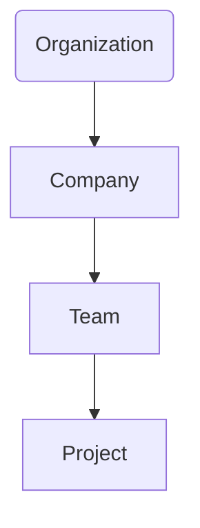

# Architecture

This document outlines the high-level architecture for the multi-tenant web application.

## System Overview

The application will be structured as a monorepo containing two main packages:

1.  **`packages/api` (Backend):** A Node.js application using the Express.js framework. Its responsibilities include:
    *   Providing a secure RESTful API for all data operations.
    *   Handling user authentication and authorization.
    *   Implementing all business logic related to the multi-tenant hierarchy.
    *   Interacting with the PostgreSQL database.

2.  **`packages/web` (Frontend):** A single-page application built with React and managed by Vite. Its responsibilities include:
    *   Rendering the user interface.
    *   Managing client-side state using Zustand.
    *   Communicating with the backend `api` service.
    *   Styling will be handled by Tailwind CSS v4.

## Data Model & Tenancy

The application follows a hierarchical multi-tenancy model.

*   **Organization (Org):** The top-level tenant. An Org can contain multiple Companies. By default, the concept of an Organization is hidden in the UI unless explicitly enabled in settings. Every user and resource will ultimately belong to an Organization.
*   **Company:** A sub-tenant within an Organization. It contains Teams and Projects.
*   **Team:** A group of users within a Company, typically working on specific Projects.
*   **Project:** The lowest level of the hierarchy, belonging to a Team.

### User & Role Model

*   **Users:** Can be members of any level of the hierarchy (Org, Company, Team).
*   **Roles:** Permissions are assigned via roles (Admin, Editor, Reader). A user can have different roles at different levels of the hierarchy. For example, a user could be an Admin of one Company and a Reader in another.
*   **Membership:** A junction table will link Users, Roles, and the specific tenant entity (Org, Company, Team, or Project) to which they have access.

## Authentication & Authorization

1.  **Authentication:** User authentication will be handled via session tokens. When a user logs in, a secure, random session token will be generated and stored in the database, linked to the user's account. This token will be sent to the client (e.g., in a secure, HTTP-only cookie) and used to authenticate subsequent requests.
2.  **Invite System:** New users can register with an invite token (UUID). This token will associate them with a pre-determined role and tenant.
3.  **Authorization:** A middleware layer on the backend will use the session token from the client to retrieve user and session information from the database. It will then check the user's roles to ensure they have the necessary permissions for any requested resource or action, enforcing the rules defined for Admin, Editor, and Reader roles.

## Deployment & Environment

The entire application will be containerized using Docker and orchestrated with a single `docker-compose.yml` file. This will manage the `api`, `web`, and `database` services for both local development and production deployment. 