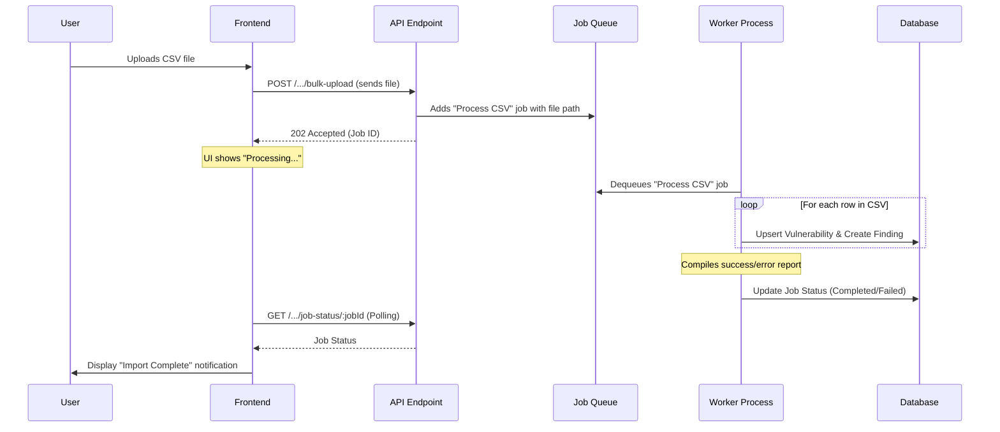

# Feature: Bulk Finding Upload

## 1. Overview & Goal

This document outlines the implementation plan for a bulk finding upload feature. This will allow users with appropriate permissions to upload a CSV file containing multiple security findings, which will be processed asynchronously and added to a project. This feature piggybacks on the existing "Add Finding" modal.

## 2. User Experience & UI Flow

1.  A user with `ADMIN` or `EDITOR` permissions clicks the "Add Finding" button.
2.  The `AddFindingModal` will open with two tabs: "Manual Entry" and "Bulk Upload".
3.  The "Bulk Upload" tab will contain:
    *   Instructions on the required CSV format.
    *   A link to download a CSV template.
    *   A file input area (supporting drag-and-drop).
4.  Upon file selection, the frontend will perform basic validation (e.g., `.csv` file type).
5.  After initiating the upload, the UI will show that the file is processing in the background. The user can close the modal.
6.  A notification will inform the user of the outcome (success or failure), with a link to download a detailed error report if any rows failed.

## 3. CSV File Format

**Required Columns:**

*   `vulnerabilityId`: The unique identifier for the vulnerability (e.g., CVE-2023-1234).
*   `title`: The title of the vulnerability.
*   `description`: A detailed description.
*   `severity`: The severity level (`CRITICAL`, `HIGH`, `MEDIUM`, `LOW`, or `INFO`).

**Optional Columns:**

*   `component`: The specific software component or location affected.
*   `notes`: Additional context or notes.

## 4. Backend Architecture: Asynchronous Processing

To ensure the application remains responsive, file processing will be handled asynchronously.

### 4.1. API Endpoint

*   `POST /api/v1/projects/:projectId/findings/bulk-upload`: Accepts `multipart/form-data`. It saves the file and queues a background job, then immediately returns `202 Accepted`.

### 4.2. Database Schema

*   A new `BulkUploadJob` model will be added to `schema.prisma` to track job status (`PENDING`, `PROCESSING`, `COMPLETED`, `FAILED`), statistics, and a link to the error report.

### 4.3. Worker Process

*   A new `worker` service will be added to the `docker-compose.yml` file.
*   It will use the same Docker image as the `api` service but will run a separate entry point script (`packages/api/src/worker.js`).
*   The worker script will poll the `BulkUploadJob` table for new jobs.
*   It will use stream parsing to read the CSV file row-by-row for memory efficiency.
*   It will reuse existing business logic to upsert vulnerabilities and create findings.
*   It will generate a downloadable error report for any failed rows.

## 5. Frontend Implementation

*   **`AddFindingModal.jsx`**: Will be updated with the "Bulk Upload" tab and file input UI.
*   **`useFindingStore.js`**: Will be extended with a `bulkUploadFindings(projectId, file)` action.
*   **Polling Logic**: The frontend will poll a new job status endpoint (`GET /api/v1/bulk-upload-jobs/:jobId`) to update the user on the import progress.
*   **Notifications**: Toast notifications will be used to provide real-time feedback.

## 6. Implementation To-Do List

- [ ] **Phase 1: Backend Foundation**
    - [ ] Create new API endpoint `POST /api/v1/projects/:projectId/findings/bulk-upload`.
    - [ ] Create a `BulkUploadJob` model in the database schema.
    - [ ] Create a `worker.js` entry point script in `packages/api/src`.
    - [ ] Add a `worker` service definition to `docker-compose.yml` and `docker-compose.prod.yml`.
    - [ ] Implement a background worker process to poll for and process jobs.
    - [ ] Implement CSV stream parsing in the worker.
    - [ ] Integrate vulnerability upsert and finding creation logic into the job processor.
    - [ ] Implement error handling and report generation for failed rows.
- [ ] **Phase 2: Frontend Development**
    - [ ] Modify `AddFindingModal.jsx` to include a "Bulk Upload" tab.
    - [ ] Add a file input component with drag-and-drop support.
    - [ ] Provide a downloadable CSV template.
    - [ ] Extend `useFindingStore.js` with a `bulkUploadFindings` action.
    - [ ] Implement polling logic to check for job completion status.
- [ ] **Phase 3: Integration & UX**
    - [ ] Implement UI notifications for upload status and completion.
    - [ ] Ensure the findings list automatically updates after import.
    - [ ] Add permission checks to the new UI elements.
- [ ] **Phase 4: Documentation**
    - [ ] Update API documentation to include the new bulk upload endpoint.
    - [ ] Create a user guide explaining how to use the new feature.